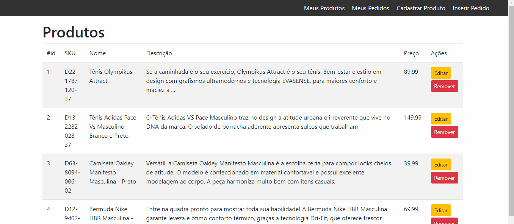

## Sobre

Sistema com criação de pedidos e seus produtos vinculados

- CRUD de produtos.
- Upload de imagens do produto.
- Relacionamento entre tabelas pedido e produto.
- Criação de pedidos.
- Visualização dos pedidos e seus produtos.

## Tecnologias

- Laravel.
- Bootstrap.

## Em Ação

## Licença

Laravel Framework [MIT license](https://opensource.org/licenses/MIT).
