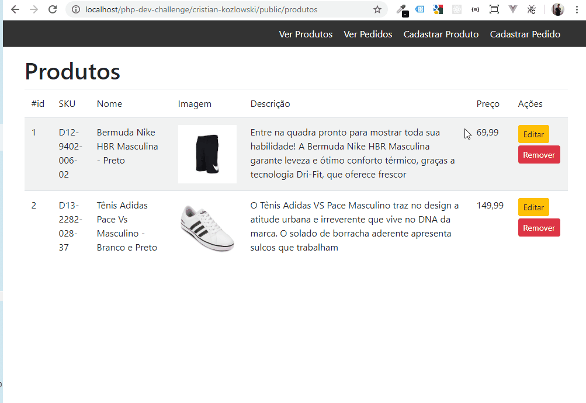

## Sobre

Sistema com criação de pedidos e seus produtos vinculados

- CRUD de produtos;
- Upload de imagem do produto;
- Preview da imagem carregada;
- Relacionamento entre tabelas pedido e produto;
- Criação de pedidos (adição de produtos via JQuery/Ajax);
- Visualização dos pedidos e seus produtos.

## Tecnologias

- Laravel.
- Bootstrap.

## Em execução

## Licença

Laravel Framework [MIT license](https://opensource.org/licenses/MIT).
